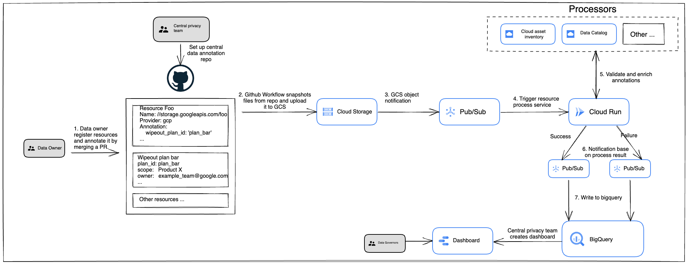

# pmap

**This is not an official Google product.**

Pmap is a service for privacy data mapping and privacy plans management to
conform with Alphabet privacy policies on data classification and inventory.

## Use case

Pmap can be used for users to map specific resources with wipeout plan to adopt
or maintain privacy policies on data classification and inventory.

## Architecture



Pmap service will be triggered when snapshots as yaml files are uploaded to GCS
bucket. A pubsub topic will subscribe the cloud storage notifications, and push
the notification to cloud run service. Cloud run service will validate and
enrich the annotations, and write the result to bigquery table.

## End User workflow

There are two ways for end users to use pmap service.

1. Upload the resource annotation as a yaml file through a PR, when the PR is
   merged, a github workflow will be triggered to snapshot the newly added files
   and upload it to Pmap service's GCS bucket. User will be able to query the
   result in bigquery table.
2. A corn job will snapshot all yaml files and upload them to pmap service's GCS
   bucket. Users will be able to query te result in bigquey table.

## Installation

You can use the provided Terraform module to setup the basic infrastructure
needed for this service. Otherwise you can refer to the provided module to see
how to build your own Terraform from scratch.

``` terraform

module "e2e" {
  source = "git::https://github.com/abcxyz/pmap.git//terraform/e2e?ref=main"

  project_id = "Your project ID"

  gcs_bucket_name                  = "Your GCS bucket name where snapshots will be uploaded to"
  pmap_container_image             = "us-docker.pkg.dev/abcxyz-artifacts/docker-images/pmap:0.0.3-amd64" 
  bigquery_table_delete_protection = true
  pmap_specific_envvars            = { "PMAP_MAPPING_DEFAULT_RESOURCE_SCOPE" : The default scope for querying cloud resources, this can be one of the following values: projects/{PROJECT_ID}, projects/{PROJECT_NUMBER}, folders/{FOLDER_NUMBER}, organizations/{ORGNANIZATION_NUMBER}}
}
```
