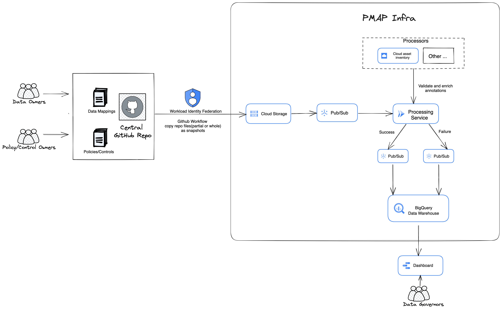

# pmap

**This is not an official Google product.**

## Background

Privacy data management is the process of collecting, storing, using, and
disposing of personal data in a way that protects the privacy of individuals. It
is a critical part of any organization that collects or uses personal data, and
organizations are typically required to maintain compliance with policies set by
regulatory bodies.

To ensure that organizations maintain compliance with policies set by regulatory
bodies, people need to know the following: 
* The requirements for what teams
must do, driven by legal requirements or external commitments (aka Privacy
Policy). This includes translating the comprehensive external legal requirements
into requirements that are tailored to products and services of the
organizations. 
* Where the user data is stored. This includes understanding the
different systems and databases that store personal data, as well as the
physical locations where user data is stored.
* Which privacy policy applies to
the datastore that stores user data(aka Data Mapping). This includes
understanding how the organization's privacy policies are applied to different
systems and databases. 
* The visibility of the privacy compliance. This includes
being able to track and monitor the organization's compliance with its privacy
policies and applicable laws and regulations.

PMAP provides a solution for the first three problems. We are working on a
solution to provide visibility of privacy compliance in the near future.

## Architecture



*   Registration - Data owners and policy owners will register data mappings and
    privacy policies in a central GitHub repository.
*   GCS Snapshots - Snapshot the data mappings and privacy policies from GitHub
    to GCS with Workload Identity Federation.
*   Additional Processors - Extension point for validation and enrichment.
*   Processing Service - The service that is responsible for ingesting,
    validating and storing the data mappings and privacy policies.
*   Storage and Analysis - The data warehouse for processed data mappings and
    privacy policies, and UI for dashboarding.

### Why GitHub

We choose GitHub as it can preserve change history and enable multi-person
review and approval. Change history and review&approval process are crucial in
privacy data management.

### Why BigQuery

We choose BigQuery for its excellent analytics support: 
* Be able to visualize
data to reveal meaningful insights 
* Ideally be able to join data from other
data sources in the future to achieve the privacy compliance monitoring.

## Set Up

The central privacy team need to complete the steps below.

### Workload Identity Federation

Set up
[Workload Identity Federation](https://cloud.google.com/iam/docs/workload-identity-federation),
and a service account with adequate condition and permission, see guide
[here](https://github.com/google-github-actions/auth#setting-up-workload-identity-federation).

```
-  Service account used in Authenticating via Workload Identity Federation
   needs [roles/storage.objectCreator]
   to snapshot the privacy mapping data/retention plans from GitHub to GCS.
```

### GitHub Central Repository

GitHub central repository is the source of truth for data mappings and privacy
policies.

The central privacy team can determine how to group privacy data
mappings/wipeout plans as long as at least one level of group are needed (Sub
folders in the root of the central GitHub repository are needed). Files
containing privacy data mappings/wipeout plans can’t be stored directly in the
root of the central GitHub repository.

#### Privacy Data Mapping

*   Presubmit workflows for sanity checks, see example
    [here](./docs/example/mapping_data_validation.yaml).

*   Postsubmit workflows to snapshot added_files and modified_files of privacy
    data mappings to GCS, see example
    [here](./docs/example/snapshot_mapping_data_change.yaml).

*   Cron Workflows to snapshot the all files of privacy data mappings to GCS,
    see example [here](./docs/example/snapshot_mapping_data_copy.yaml).

#### Privacy Policy

*   Postsubmit workflows to snapshot added_files and modified_files of privacy
    policies to GCS, see example
    [here](./docs/example/snapshot_privacy_policy_change.yaml).

*   Cron Workflows to snapshot the all files of privacy policies to GCS, see
    example [here](./docs/example/snapshot_privacy_policy_copy.yaml)

### Infrastructure for pmap

You can use the provided Terraform module to setup the basic infrastructure
needed for this service. Otherwise you can refer to the provided module to see
how to build your own Terraform from scratch.

```terraform
module "pmap" {
  source = "git::https://github.com/abcxyz/pmap.git//terraform/e2e?ref=main" # this should be pinned to the SHA desired

  project_id = "YOUR_PROJECT_ID"

  gcs_bucket_name                  = "pmap"
  pmap_container_image             = "us-docker.pkg.dev/abcxyz-artifacts/docker-images/pmap:0.0.3-amd64"
  bigquery_table_delete_protection = true
  # This is used when searching global Cloud Resources like GCS bucket.
  pmap_specific_envvars            = { "PMAP_MAPPING_DEFAULT_RESOURCE_SCOPE" : "YOUR_DEFAULT_RESOURCE_SCOPE" }
}
```

## End User Workflows

### Policy Owner

*   Create a privacy policy (wipeout plan etc.) by opening a PR in the yaml
    format file (file has `.yaml` filename suffix) under the sub folder where
    stores
    all the privacy policies. See example
    [here](./docs/example/wipeout_plan.yaml).

### Data Owner

*   Register and annotate resources to associate the resources to its specific
    wipeout plan by opening a PR in the yaml format file (file has `.yaml`
    filename suffix) under the sub folder where stores
    all the privacy data mappings. See example
    [here](./docs/example/resource_mapping.yaml). **NOTE:** The association of
    the resource to the wipeout plan is achieved via `annotations` field.

### Data Governor(TODO)